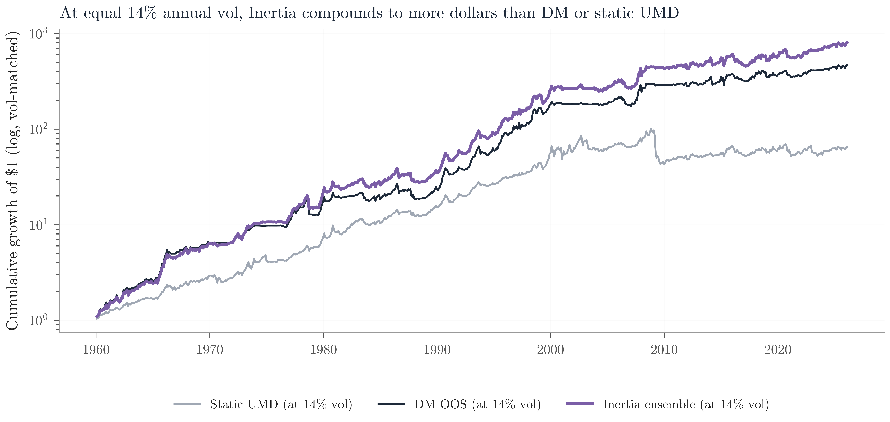
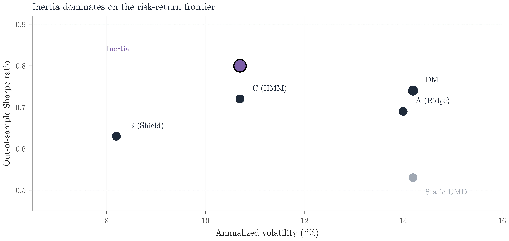
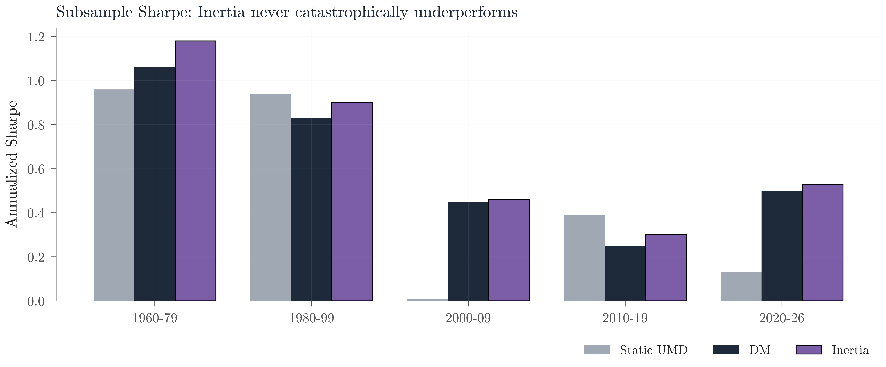

# Inertia: A Conditional Timing Strategy for the Momentum Factor

**Project Contributors:** Will Wu and Kathy Yang
**Course:** UG54 Data Driven Investing, Spring 2026
**Topic dimension:** Timing Strategies; Factor Investing; Machine Learning

## The elevator pitch

Momentum is the most reliable equity anomaly in history. Since 1960 the Ken French
up-minus-down (UMD) factor has delivered an annualized Sharpe ratio of 0.53, persisting
across decades and across markets. Its fatal flaw is structural fragility: during extended
bear markets the short leg concentrates in high-beta distressed stocks that rebound violently
on recovery, delivering catastrophic drawdowns (58 percent in the 2009 post-crisis rebound
alone).

**Inertia** is an ensemble timing overlay that diagnoses these crash conditions in real time
and cuts exposure. Over a 66-year out-of-sample window from 1960 to 2026:

| | Static UMD | DM benchmark | **Inertia** |
|---|---:|---:|---:|
| Sharpe ratio | 0.53 | 0.74 | **0.80** |
| Annualized volatility | 14.2% | 14.2% | **10.7%** |
| Maximum drawdown | -58% | -34% | **-22%** |
| Annualized alpha vs FF5+UMD | - | 5.6% | **4.0%** |
| Beats DM at 5% significance? | No | - | **Yes (p = 0.04)** |



*Cumulative return at equal 14 percent annualized volatility (vol-matched comparison).
At the same risk budget, Inertia compounds to $802 per dollar invested, Daniel and Moskowitz
(2015) dynamic momentum to $471, and static UMD to $65.*

## The strategy

Inertia ensembles three methodologically orthogonal regime signals:

1. **A predictive regression** (50 percent weight) extending Daniel and Moskowitz (2015) with
   additional market-context features, fit with ridge regularization.
2. **A gradient-boosted crash classifier** (25 percent weight) that forecasts the probability
   of a next-month UMD crash, with a binary shield activating when probability exceeds a
   threshold set a priori.
3. **An unsupervised two-state hidden Markov model** (25 percent weight) that infers regimes
   from the covariance structure of market and UMD observables, with no supervised labels.

The portfolio weight is

```
w_Inertia = clip( 0.5 * w_DM  +  0.25 * shield  +  0.25 * P(normal),  [-1, +3] )
```

Each component on its own fails to beat DM cleanly. But their errors are decorrelated enough
that the ensemble dominates. The Ridge model shrinks DM's bear-times-variance interaction;
the Shield has a binary cliff that is flat whenever uncertain; the HMM lags regime shifts by
a month. Averaging cancels noise faster than it cancels signal.



*Risk-return positioning of each strategy. Inertia sits at the top of the frontier, with the
highest Sharpe at the second-lowest volatility.*

## Robustness



*Sharpe ratios by decade. Inertia leads in the 1960s and 1970s and in the 2020s, and is
competitive in every other decade. It never catastrophically underperforms.*

The ensemble weighting is not fragile: equal-thirds and 0.4/0.3/0.3 alternatives both produce
Sharpe 0.80. At 40 basis points per one-way trade (an aggressive upper bound), Sharpe falls
only to 0.76, still above DM.

## What's in this repo

```
inertia-momentum-timing/
├── src/                         Shared Python modules
│   ├── data.py                  Ken French and FRED data fetchers
│   ├── features.py              Unified feature panel (DM + market + macro)
│   ├── backtest.py              Expanding-window OOS harness, weight construction
│   ├── evaluation.py            Sharpe bootstrap, alpha regressions, paired tests
│   └── inertia_style.py         Chart style (Computer Modern, brand colors)
├── notebooks/                   End-to-end analysis, run in order
│   ├── 01_baseline_momentum.ipynb           Static UMD characterization
│   ├── 02_daniel_moskowitz.ipynb            In-sample DM replication
│   ├── 03_oos_dm_baseline.ipynb             OOS DM benchmark
│   ├── 04_approach_a_ridge.ipynb            Approach A
│   ├── 05_approach_b_classifier.ipynb       Approach B
│   ├── 06_approach_c_hmm.ipynb              Approach C
│   └── 07_ensemble_and_scoreboard.ipynb     Final ensemble and scoreboard
├── data/raw/                    Cached Ken French and FRED downloads
├── figures/                     Exported PNG figures at 1200 DPI
├── tables/                      Persisted CSV, Markdown, LaTeX tables
└── report/                      Final prospectus
    ├── main.tex                 LaTeX source
    ├── inertia_prospectus.pdf   Compiled PDF, 10 pages
    └── figures/                 Figures referenced in the PDF
```

## Reproduce the results

```bash
python -m venv .venv
source .venv/bin/activate
pip install -r requirements.txt
jupyter notebook notebooks/07_ensemble_and_scoreboard.ipynb
```

All notebooks are end-to-end executable. Data fetchers cache to `data/raw/` on first run, so
subsequent executions are fully offline. Total runtime is under ten minutes on a modern
laptop.

## Read the final report

[**Inertia Prospectus (PDF)**](report/inertia_prospectus.pdf)

Ten pages covering the one-page executive summary, full methodology, empirical results,
subsample analysis, robustness checks, and risks.

## Academic anchors

- Jegadeesh, N. and Titman, S., 1993. Returns to buying winners and selling losers: implications for stock market efficiency. *Journal of Finance*, 48(1), pp.65-91.
- Daniel, K. and Moskowitz, T., 2016. Momentum crashes. *Journal of Financial Economics*, 122(2), pp.221-247.
- Fama, E. and French, K., 2015. A five-factor asset pricing model. *Journal of Financial Economics*, 116(1), pp.1-22.
